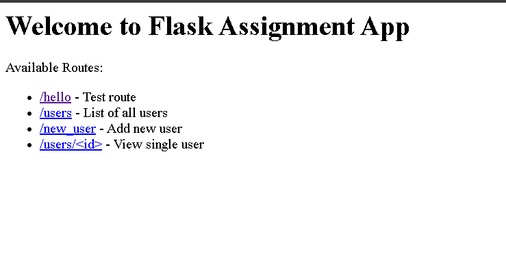

# eActive Assignment - Flask Application

## Overview
This is a Flask-based web application for managing users and related data. It uses MySQL as the backend database and follows a simple Git workflow for development and contributions.

---

## Table of Contents
- [Setup Instructions](#setup-instructions)  
- [Database Schema](#database-schema)  
- [Sample Data](#sample-data)  
- [Dependencies](#dependencies)  
- [Git Workflow & Contribution](#git-workflow--contribution)

---

## Setup Instructions

### 1. Clone the repository
```bash
git clone https://github.com/divyanz-code/eactive_assignment.git
cd eactive_assignment
```

### 2. Create and activate a virtual environment

**Windows:**
```bash
python -m venv env
env\Scripts\activate
```

**macOS/Linux:**
```bash
python3 -m venv env
source env/bin/activate
```

### 3. Install dependencies
```bash
pip install -r requirements.txt
```

### 4. Configure the database connection
Update your database credentials in `app.py` or the configuration file:

```python
host="localhost"
user="root"
password="your_password"
database="users"
```

### 5. Create the database and table
Run the following SQL commands in your MySQL client:

```sql
CREATE DATABASE users;
USE users;

CREATE TABLE users (
    id INT PRIMARY KEY AUTO_INCREMENT,
    name VARCHAR(50) NOT NULL,
    email VARCHAR(100) UNIQUE NOT NULL,
    role VARCHAR(20) NOT NULL
);
```

### 6. Run the Flask application
```bash
python app.py
```

### 7. Access the application
Open your browser and navigate to: `http://127.0.0.1:5000/`

---

## Database Schema

### Table: `users`

| Column | Type         | Description           |
|--------|--------------|-----------------------|
| id     | INT          | Primary Key (Auto Increment) |
| name   | VARCHAR(50)  | User's full name      |
| email  | VARCHAR(100) | User's email (Unique) |
| role   | VARCHAR(20)  | User role (Admin/User)|

---

## Sample Data

To populate the `users` table with sample data, run the following SQL:

```sql
INSERT INTO users (name, email, role)
VALUES
('Divyansh', 'divyansh@gmail.com', 'Admin'),
('Jatin', 'jatin@gmail.com', 'User');
```

---

## Dependencies

- **Flask** - Web framework
- **mysqlclient** - Python MySQL connector
- Other dependencies are listed in `requirements.txt`

### Install all dependencies:
```bash
pip install -r requirements.txt
```

---

## Git Workflow & Contribution

### Branching Strategy
- All development should happen on **feature branches** (e.g., `assignment`, `main`)
- Keep the `main` branch stable and production-ready

### Making Changes

```bash
# Switch to your branch
git checkout assignment

# Make changes and commit
git add .
git commit -m "Initial commit - Flask app and MySQL setup"
git push origin assignment
```

### Creating Pull Requests
1. Open a **Pull Request (PR)** from your branch to `main` on GitHub
2. Include a clear description of your changes
3. PRs should be reviewed before merging into `main`

### Merging
- After review, merge the PR into `main` using GitHub interface
- Delete the feature branch after merging if no longer needed

### Updating Your Branch
```bash
# Fetch latest changes from remote
git fetch origin

# Merge main into your current branch
git merge origin/main

# Or rebase your branch on top of main
git rebase origin/main
```

### Syncing with Remote
```bash
# Pull latest changes
git pull origin main

# Push your changes
git push origin assignment
```

---

## Project Structure

```
eactive_assignment/
│
├── app.py              # Main Flask application
├── requirements.txt    # Python dependencies
├── README.md          # Project documentation
├── templates/         # HTML templates
└── env/              # Virtual environment (not in repo)
```

---

## Contributing

1. Fork the repository
2. Create your feature branch (`git checkout -b feature/AmazingFeature`)
3. Commit your changes (`git commit -m 'Add some AmazingFeature'`)
4. Push to the branch (`git push origin feature/AmazingFeature`)
5. Open a Pull Request

---

## License

This project is part of the eActive assignment.

---

## Details


## Contact

**Divyansh** - [divyanshpali123@gmail.com](mailto:divyanshpali123@gmail.com)

Project Link: [https://github.com/divyanz-code/eactive_assignment](https://github.com/divyanz-code/eactive_assignment)
